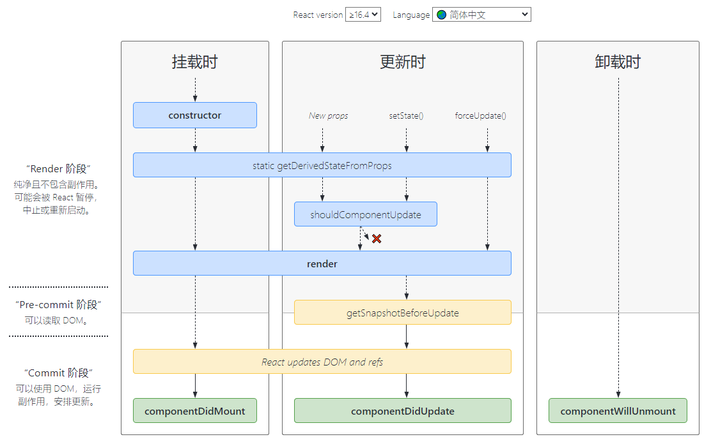

# React 基础语法

## 概要
`提示：什么是 react？`

[React](https://zh-hans.react.dev/learn) 是一个用于构建用户界面的 JavaScript 库。它由 Facebook 开发和维护，自推出以来，因其高效、灵活和强大的特性迅速获得了广泛的应用。React 通过组件化开发和虚拟DOM技术，使得复杂的用户界面更易于管理和优化。

<!-- ## 技术细节 -->

## 一、JSX 语法规则

**1. 定义虚拟 DOM 时不用写引号**

  在定义虚拟 DOM 时，不需要使用引号包裹字符串。示例：

```jsx
const element = <h1>Hello, world!</h1>

// 获取DOM
<input type="text" ref={ inputRef } />
const inputRef = useRef<HTMLInputElement>(null)
console.log(inputRef.current)
```

**2. 标签 class 类名不能用 `class`，要用 `className`**

  在 JSX 中，使用 `className` 来定义 CSS 类，而不是 `class`。示例：
```jsx
<div className="my-class"></div>
```

**3. 标签内联样式要用 `{ {} }`**

  在 JSX 中，内联样式需要使用双层大括号，第一层是 JSX 表达式，第二层是样式对象。示例：
```jsx
<div style={{ color: "red", fontSize: "20px" }}></div>
```

**4. 标签中混入 JavaScript 表达式要用 `{}`**

  在 JSX 中，可以使用 `{}` 来插入 JavaScript 表达式。示例：
```jsx
/** 列表渲染  */
const vdom = (
  <ul>
    {data.map((item, index) => {
      return <li key={index}>{item}</li>
    })}
  </ul>
)

/** 条件渲染 */
<div>
  { isFlag && <div>状态为真</div> }
  { !isFlag ? <div>状态为假</div> : <div>状态为真</div> }
  { /** 复杂条件渲染 */ }
  { getArticleTem() }
</div>

/** 事件绑定 */
<div>
  { /** 事件对象e和自定义形参传递 */ }
  <button onClick={ (e)=> handleClick('zeMing', e) }>点击</button>
</div>
```

**5. 只能有一个根标签**

  每个 JSX 表达式必须有且仅有一个根标签。示例：
```jsx
const element = (
  <div>
    <h1>Hello, world!</h1>
    <p>This is a paragraph.</p>
  </div>
)
```

**6. 标签必须闭合**

  所有 JSX 标签必须闭合，即使是单个标签也需要使用自闭合语法。

**7. 标签首字母**

  - 以小写字母开头的标签会被转化为 HTML 元素，如果 HTML 中没有这个元素，则会报错。
  - 以大写字母开头的标签会被当成一个自定义组件。
```jsx
// 以小写字母开头
const element = <div></div> // 转化为 HTML 的 <div>

// 以大写字母开头
const MyComponent = () => <div></div>
const element = <MyComponent /> // 被当成自定义组件
```

**8. 常见写法**
```jsx
// 如果想要修改它，那么必须这么做
const [form, setForm] = useState({
  name: 'zeMing',
})
setForm({
  ...form,
  name: 'hello'
})

// 如果需要动态className，那么也需要这么做
<div className={classNames('item', { active: typeId === item.id })}></div> // npm i classnames
<div className={`item ${typeId === item.id && 'active'}`}></div>
```

## 二、函数式组件

### 1. 定义
函数中的 `this` 指向 `undefined` ，因为 babel 编译后开启了严格模式
```jsx
function MyComponent() {
  return <h2>我是一个函数式组件</h2>
}
```

### 2. props
props可以传递任意的数据：数字、字符串、布尔值、数组、对象、函数、JSX。子组件只能读取props中的数据，不能直接修改，父组件的数据只能由父组件修改。

三大属性中，只有 `props` 可以用于函数组件，因为函数可以接收参数，`state` 和 `refs` 都不能用于函数组件。

::: code-group
```jsx [父传子]
// 父组件
function App() {
  return (
    <div>
      <Person { ...form } />
      {/* 或 */}
      <Person name={ name } age={ age } isTrue={ true } />

      {/* 成对标签类似vue的slot，可以在props中的children直接使用它 */}
      <Person>
        <div>this is children</div>
      </Person>
    </div>
  )
}

// 子组件
function Person(props) {
  const { name, age, isTrue, children } = props
  return (
    <ul>
      <li>姓名：{ name }</li>
      <li>年龄：{ age }</li>
      { children }
    </ul>
  )
}

// 函数组件限制props只能使用此方法
Person.propTypes = {
  name: PropTypes.string.isRequired, //限制name必传，且为字符串
  sex: PropTypes.string, //限制sex为字符串
  age: PropTypes.number, //限制age为数值
}

// 指定默认标签属性值
Person.defaultProps = {
  sex: "男", //sex默认值为男
  age: 18, //age默认值为18
}
```

```jsx [子传父]
// 父组件
function App() {
  const [msg, setMsg] = useState('')
  const getMsg = (msgdata) => {
    setMsg(msgdata)
  }

  return (
    <div>
      { msg }
      <Son onGetSonMsg={ getMsg } />
    </div>
  )
}


// 子组件
function Son({ onGetSonMsg }) {
  const msg = '子组件数据'
  return (
    <button onClick={() => onGetSonMsg(msg)}>点击传递参数</button>
  )
}
```

```jsx [兄弟组件通信]
// 父组件
function App() {
  const [name, setName] = useState('')
  const getAName = (namedata: string) => {
    setName(namedata)
  }
  return (
    <>
      this is app
      <A onGetAName={getAName} />
      <B name={name} />
    </>
  )
}

// 子组件
function A({ onGetAName }) {
  const name = 'this is A name'
  return (
    <div>
      this is A 
      <button onClick={() => onGetAName(name)}>send</button>
    </div>
  )
}
function B({name}) {
  return (
    <div>this is B {name}</div>
  )
}
```

```jsx [Context 跨层级组件通信]
const MsgContext = createContext(null)
// 父组件
function App() {
  const msg = 'this is appMsg'
  return (
    <>
      <MsgContext.Provider value={ msg }>
        this is app
        <A />
      </MsgContext.Provider>
    </>
  )
}

// 子组件
function A() {
  return (
    <div>
      this is A 
      {/* 使用B组件 */}
      <B />
    </div>
  )
}
function B() {
  const msg = useContext(MsgContext)
  return (
    <div>this is B, {msg}</div>
  )
}
```
:::

### 3. Hooks

为了解决函数组件缺失类组件中的 state 、refs 和生命周期这些能力的问题，引入的一些特殊函数。

- #### **3.1 useState()**
::: tip
>类似于类组件中的 state 和 setState，用于在函数组件中添加状态。

参数：接受一个参数，这个参数是状态的初始值。这个初始值可以是任意类型，例如数字、字符串、数组、对象等。

返回值：返回一个数组，数组包含两个元素
:::

```js
// 1、state：当前状态的值
// 2、setState：状态更新函数，接受一个新状态值作为参数，或一个返回新状态值的函数
const [state, setState] = useState(initialState)
```

**示例:**

```jsx
import { useState } from "react"

function App() {
  // 初始化一个名为 "count" 的状态变量，初始值为 0
  const [count, setCount] = useState(0)
  const add = () => {
    setCount(count + 1)
  }

  return (
    <div>
      <h2>当前和为：{count}</h2>
      <button onClick={add}>点击加1</button>
    </div>
  )
}
```

- #### **3.2 useEffect()**


类似于类中的生命周期，可以将 `useEffect` 视为 `componentDidMount`、`componentDidUpdate` 和 `componentWillUnmount` 的组合。

::: tip useEffect 接受两个参数：[react文档详情](https://zh-hans.react.dev/reference/react/useEffect)


**1. 副作用函数**：一个在组件渲染后执行的函数。

**2. 依赖项数组（可选）**：一个数组，包含影响副作用的变量。如果数组中的变量发生变化，副作用函数会重新执行。
:::

```js
useEffect(() => {
  // 副作用操作
}, [])
```

**副作用函数执行的时机：**

1. 不传第二个参数时，无论是组件初次挂载还是更新时，副作用函数都会执行。这个行为类似于类组件中的 `componentDidMount` 和 `componentDidUpdate` 生命周期方法的组合。

::: info 提示
在这个示例中，每次 Counter 组件渲染时，useEffect 中的副作用函数都会执行一次。也就是说，每当 count 状态更新并导致组件重新渲染时，console.log('Effect executed') 都会被调用
:::

2. 第二个参数为空数组时，只会在组件挂载时执行一次，并且不会在组件更新时重新执行。
::: info 提示
在这个示例中，数据获取操作只会在组件首次挂载时执行一次。由于依赖项数组为空，数据获取操作不会在组件更新时重新执行
:::

3. 传第二个参数且参数不为空数组时，数组中的变量发生变化时执行。

::: code-group
```jsx [不传第二个参数]
import { useState, useEffect } from "react"

function Counter() {
  const [count, setCount] = useState(0)

  // 没有依赖项数组
  useEffect(() => {
    console.log("副作用函数执行了")
  })

  return (
    <div>
      <p>You clicked {count} times</p>
      <button onClick={() => setCount(count + 1)}>Click me</button>
    </div>
  )
}
```

```jsx [第二个参数为空数组]
import { useState, useEffect } from "react"

function DataFetcher() {
  const [data, setData] = useState(null)

  useEffect(() => {
    // 模拟数据获取
    fetch("https://api.example.com/data")
      .then((response) => response.json())
      .then((data) => setData(data))
      .catch((error) => console.error("Error fetching data:", error));
  }, []) // 空数组作为依赖项

  return (
    <div>
      {data ? <pre>{JSON.stringify(data, null, 2)}</pre> : "Loading..."}
    </div>
  )
}
```

```jsx [传第二个参数且参数不为空数组]
import { useState, useEffect } from "react"
  
function Counter() {
  const [count, setCount] = useState(0)

  useEffect(() => {
    console.log(`Count changed: ${count}`)
  }, [count])

  return (
    <div>
      <p>{count}</p>
      <button onClick={() => setCount(count + 1)}>Increment</button>
    </div>
  )
}
```
:::

**副作用函数的返回值：**

如果返回一个匿名函数，则这个函数将会在组件卸载或在下一次副作用函数执行前执行，相当于类组件中的 `componentWillUnmount`生命周期方法

  ```jsx
  import { useEffect } from "react"

  function Timer() {
    useEffect(() => {
      const timerId = setInterval(() => {
        console.log("Tick")
      }, 1000)

      return () => {
        clearInterval(timerId)
        console.log("Timer cleared") // 组件卸载时执行
      }
    }, [])

    return <div>Check the console for timer updates</div>
  }
  ```

- #### **3.3 useRef()**

类似于 createRef()，创建一个用于包裹 dom 元素的容器，用以操作 dom。

::: tip useRef()

**参数：**  接受一个参数，这个参数是引用的初始值。通常情况下，如果用于访问 DOM 元素，初始值可以是 `null`

**返回值：** 返回一个对象，这个对象有一个名为 `current` 的属性，`current` 属性用于存储引用的值
:::

```js
// refContainer.current：引用的当前值
const refContainer = useRef(initialValue)
```

**示例:**

```jsx
import { useRef } from "react"

function App() {
  const inputEl = useRef(null)

  const handleClick = () => {
    inputEl.current.focus()
  }

  return (
    <div>
      <input ref={inputEl} type="text" />
      <button onClick={handleClick}>Focus the input</button>
    </div>
  )
}
```

## 三、类组件

### 1. 定义

```jsx
class MyComponent extends React.Component {
  render() {
    return <h2>我是用类定义的组件</h2>
  }
}
```
  - 类组件必须继承 React 内置的 `React.Component` 类。
  - 在类组件中，JSX 代码必须写在 `render` 方法中，并且 `render` 方法必须有返回值。
  - `render` 方法被定义在类的原型对象上，因此可以供实例使用。
  - `render` 方法中的 this 指向由类(new)创建的实例。

通过这些规则，可以正确地定义和使用类组件，提高组件的可维护性和可读性。

### 2. 实例的三大属性

- **state**

组件的状态，类似于 vue 中的响应式数据。

```jsx
class MyComponent extends React.Component {
  // 通常，在 React 中构造函数仅用于两个目的：
  // 1、通过将对象分配给来初始化本地状态this.state。
  // 2、将事件处理程序方法绑定到实例。
  constructor(props) {
    super(props)
    // 初始化 state
    this.state = { isHot: false, wind:'微风'}
    // 改变事件处理函数中的this指向
    // this.click = this.handleClick.bind(this)
  }

  render() {
    // 读取state 中的值
    const { isHot，wind} = this.state
    // 原生JS中的 onclick 事件，在 react 中要写成 onClick，其他同理
    return (
      <div>
        <h2>今天天气很{ isHot ? '炎热': '凉爽'}</h2>
        <h2>{ wind }</h2>
        <button onClick={this.handleClick}>更改</button>
      </div>
    )
  }

  // ！！！注意：此处必须要用箭头函数，否则会改变this的指向
  handleClick = () => {
    // 状态必须通过 setState 以对象的形式进行更新，且更新是一种合并，不是替换
    const { wind } = this.state
    // setState 是同步的，但数据更新是异步的，只能在回调中拿到更新后的数据
    this.setState({ wind: '斜阳'}, ()=> {
      console.log(this.state.wind)
    })
    // 函数式的 setState，新的数据依赖于原数据
    this.setState(state => ({ count: state.wind + '斜阳'}))
  }

  // 若不使用箭头函数，可以在 constructor 中用 bind 重新指回 this
  handleClick() => {
    // 更新state中的值
    const { wind } = this.state
    this.setState({ wind: '斜阳'})
  }
}
```

- **props**

通过标签属性从组件外向组件内传递变化的数据

```jsx
// 直接传值
<Person name="李华" age={18} sex="男" />

// 或批量传值
const obj = { name: "李华", age: 18, sex: "男"}
<Person {...obj} />

class Person extends React.Component {
  // 可省略
  constructor(props) {
    super(props)
  }

  render() {
    const { name, age, sex } = this.props
    return(
      <ul>
        <li>{ name }</li>
      </ul>
    )
  }
}
```

- 组件标签的所有属性都以 { key: value } 的形式保存在`props`中

- 单向数据流，组件内部不要修改`props`数据

- 限制 props（需要引入 prop-types 库）

::: code-group

```jsx [写在类外面]
// 指定数据类型
Person.propTypes = {
  name: PropTypes.string.isRequired, //限制name必传，且为字符串
  sex: PropTypes.string, //限制sex为字符串
  age: PropTypes.number, //限制age为数值
  speak: PropTypes.func, //限制speak为函数
};
// 指定默认值
Person.defaultProps = {
  sex: "男", //sex默认值为男
  age: 18, //age默认值为18
};

class Person extends React.Component {
  // 可省略
  constructor(props) {
    super(props);
  }

  render() {
    const { name, age, sex } = this.props;
    return (
      <ul>
        <li>{name}</li>
        <li>{age}</li>
      </ul>
    )
  }
}
```

```jsx [写在类里面]
class Person extends React.Component {
  // 可省略
  constructor(props) {
    super(props);
  }

  // 指定数据类型
  static propTypes = {
    name: PropTypes.string.isRequired, //限制name必传，且为字符串
    sex: PropTypes.string, //限制sex为字符串
    age: PropTypes.number, //限制age为数值
  };

  // 指定默认值
  static defaultProps = {
    sex: "男", //sex默认值为男
    age: 18, //age默认值为18
  };

  render() {
    const { name, age, sex } = this.props;
    return (
      <ul>
        <li>{name}</li>
        <li>{age}</li>
      </ul>
    );
  }
}
```
:::

- **refs**

组件内的标签可以定义`ref`属性来标识自己（类似于 id）

::: code-group
```jsx [推荐使用 createRef]
class Demo extends React.Component {
  myRef1 = React.createRef()
  myRef2 = React.createRef()

  render() {
    return (
      <div>
        <input ref={myRef1} type="text" />
        <input ref={myRef2} type="text" />
        <button onClick={this.handleClick}>点击</button>
      </div>
    )
  }

  handleClick = () => {
    console.log(this.myRef1.current.value)
  }
}
```

```jsx [字符串形式的 ref 不推荐使用]
class Demo extends React.Component {
  render() {
    return (
      <div>
        <input ref="input1" type="text" />
        <input ref="input2" type="text" />
        <button onClick={this.handleClick}>点击</button>
      </div>
    )
  }

  handleClick = () => {
    // refs 是一个数组，他收集了组件内的所有 ref。这里的 input1
    const { input1, input2 } = this.refs
  }
}
```
:::

**`React.createRef` 调用后可以返回一个容器，该容器可以存储被 `ref` 所标识的节点**

### 3. 受控组件与非受控组件

- **非受控组件**

页面中所有的输入类 DOM 现用现取，即通过 `ref` 标识 DOM，进而获取数据

```jsx
class Login extends React.Component {
  render() {
    return (
      <form onSubmit={this.handleSubmit}>
        用户名：
        <input ref={(c) => (this.username = c)} type="text" name="username" />
        密码：
        <input
          ref={(c) => (this.password = c)}
          type="password"
          name="password"
        />
        <button>登录</button>
      </form>
    );
  }

  handleSubmit = (event) => {
    event.preventDefault(); //阻止表单提交
    const { username, password } = this;
    alert(
      `你输入的用户名是：${username.value},你输入的密码是：${password.value}`
    );
  };
}
```

- **受控组件**

用 `onChange` + `state` 实现，页面中所有的输入类 DOM 将数据存在 `state` 中

```jsx
class Login extends React.Component {
  //初始化状态
  state = {
    username: "", //用户名
    password: "", //密码
  };

  render() {
    return (
      <form onSubmit={this.handleSubmit}>
        用户名：
        <input onChange={this.saveUsername} type="text" name="username" />
        密码：
        <input onChange={this.savePassword} type="password" name="password" />
        <button>登录</button>
      </form>
    );
  }

  // 保存用户名到状态中
  saveUsername = (event) => {
    this.setState({ username: event.target.value });
  };

  // 保存密码到状态中
  savePassword = (event) => {
    this.setState({ password: event.target.value });
  };

  // 表单提交的回调
  handleSubmit = (event) => {
    event.preventDefault(); //阻止表单提交
    const { username, password } = this.state;
    alert(`你输入的用户名是：${username},你输入的密码是：${password}`);
  };
}
```

- **使用函数柯里化优化受控组件**

函数的柯里化：通过函数调用继续返回函数的方式，实现多次接收参数最后统一处理的函数编码形式

```js
function sum(a) {
  return (b) => {
    return (c) => {
      return a + b + c;
    };
  };
}
```

利用函数柯里化优化 saveUserName 和 savePassword

```jsx
class Login extends React.Component {
  //初始化状态
  state = {
    username: "", //用户名
    password: "", //密码
  };

  render() {
    return (
      <form onSubmit={this.handleSubmit}>
        用户名：
        <input
          onChange={this.saveFormData("username")}
          type="text"
          name="username"
        />
        密码：
        <input
          onChange={this.saveFormData("password")}
          type="password"
          name="password"
        />
        <button>登录</button>
      </form>
    );
  }

  // 保存表单数据到状态中（函数的柯里化）
  saveFormData = (dataType) => {
    // onChange 接受的是 saveFormData 返回的箭头函数，刚好符合事件处理的回调函数
    return (event) => {
      this.setState({ [dataType]: event.target.value });
    };
  };

  // 表单提交的回调
  handleSubmit = (event) => {
    event.preventDefault(); //阻止表单提交
    const { username, password } = this.state;
    alert(`你输入的用户名是：${username},你输入的密码是：${password}`);
  };
}
```

- **不使用函数柯里化优化受控组件**

```jsx
saveFormData = (dataType,event)=>{
  this.setState({[dataType]:event.target.value})
}

用户名：<input onChange={event => this.saveFormData('username',event) } type="text" name="username"/>

```

### 4. 生命周期

生命周期大致可划分为三个阶段：

**1. 挂载**：创建组件实例并将其插入到 DOM 中

**2. 更新**：props 或 state 的改变引起组件重新渲染

**3. 卸载**：组件从 DOM 中移除

```jsx
class Life extends React.component {
  // 初始化
  constructor() {
    console.log("1-1");
  }

  // 挂载
  render() {
    console.log("1-2");
  }

  // 挂载完成
  componentDidMount() {
    console.log("1-3");
  }

  // 更新前
  shouldComponentUpdate() {
    console.log("2-1");
  }

  // 更新完成
  componentDidUpdate() {
    console.log("2-2");
  }

  // 卸载前
  componentWillUnmount() {
    console.log("3-1");
  }
}
```

生命周期图


