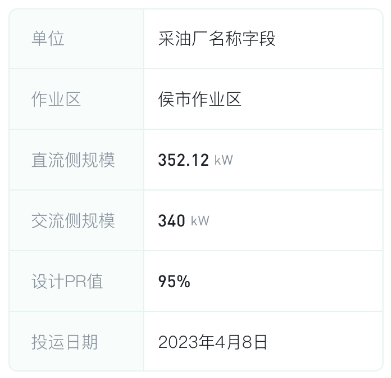

# css布局

## 概要
`提示：提供一些常见布局`

目前，`Flexbox` 是一种非常常见的 CSS 布局方式，但很多人在学习和使用时并未真正掌握它的核心思想。在编写 CSS 时，为什么要固定元素的宽高呢？这是一个误区，因为你无法预料某个元素的内容未来会有多高。此外，固定宽高会导致内容在不同设备上出现不适配的问题，尤其是在屏幕大小变化时，内容容易被挤压、换行。例如，设计稿在 1080 像素的屏幕上一行显示的内容，到了 750 像素的设备上就可能换行。

通过深入学习，我发现 `flex-basis` 是一个非常实用的属性。如果你想实现特定的布局效果，使用 `Flexbox` 可以非常轻松地完成。
## 技术细节
#### 1. 二宫格布局
```scss
.gridWrap {
  display: flex;
  flex-wrap: wrap;

  .gridItem {
    flex: 1;
    flex-basis: 50%;
    box-sizing: border-box;

    &:nth-child(2n) {
      padding-left: 24rpx; // 希望两个之间有间隙的做法
    }
  }
}
```

实现这个左右效果不需要固定宽


<div style="display: flex;align-items: center;color: #fff;">
  <div style="flex:1;background: #01cfab;padding: 16px;">左侧</div>
  <div style="flex:2;background: #81eccf;padding: 16px;">右侧</div>
</div>

```scss
.infoItem {
  display: flex;
  align-items: center;

  .infoKey {
    flex: 1;
  }

  .infoValue {
    flex: 2;
  }
}
```

#### 2. 三宫格布局-中间居中
```scss
.wrap {
  display: flex;
  flex-wrap: wrap;

  .item {
    width: 32%;
    height: 100px;
    margin-bottom: 10px;
    background-color: #ccc;

    &:nth-child(3n+2) {
      margin-right: 2%;
      margin-left: 2%;
    }

    &:nth-child(3n+1) {
      margin-left: 0;
    }

    &:nth-child(3n+3) {
      margin-right: 0;
    }
  }
}
```

#### 3. 四宫格布局-中间居中
```scss
// 使用flex、gap属性来设置间隙
.imgWrap {
  width: 100%;
  max-height: 400px;
  display: flex;
  flex-wrap: wrap;
  padding: 20px 0;
  overflow-y: auto;
  gap: 16px;

  .imgWrap_item {
    width: calc(25% - 12px);
    height: 200px;
  }
}

// 或者使用margin来设置间隙
.imgWrap {
  width: 100%;
  max-height: 400px;
  display: flex;
  flex-wrap: wrap;
  padding: 20px 0;
  overflow-y: auto;
  margin: -8px;

  .imgWrap_item {
    position: relative;
    width: calc(25% - 16px);
    height: 200px;
    margin: 8px;
  }
}
```

#### 4. 各种机型底部的安全区域
```css
.item {
  padding-bottom: calc(env(safe-area-inset-bottom) + 20rpx);
}
```

#### 5. 常用css
```scss
.item {
  word-break: break-all; // 纯数字换行
  shape-outside: circle(50% at 50% 50%); // 不规则的文字环绕
}

// 滑动吸附效果--常见于swiper
.wrap {
  scroll-snap-type: x mandatory; // 可更换为proximity 表示为附近吸附

  .item {
    scroll-snap-align: start; // 排列
    scroll-snap-stop: always; // 吸附是否停止
  }
}
```

#### 6. css好网站
这里是一些优秀的网站资源，可以用于 CSS 相关的开发和设计：
- [毛玻璃](http://tool.mkblog.cn/glassmorphism/) - 一个生成毛玻璃效果的在线工具。
- [毛玻璃](https://glassgenerator.netlify.app/) - 另一个生成毛玻璃效果的在线工具。
- [拟态风风格 CSS 代码](http://tool.mkblog.cn/neumorphism/#e0e0e0) - 提供拟态风格（Neumorphism）的 CSS 代码生成器。
- [不规则图形css](https://csstrick.alipay.com/) - 一个可以生成不规则图形的在线工具。
- [clip-path 在线网站](http://tools.jb51.net/code/css3path) - 用于生成 CSS clip-path 属性的在线工具。
- [雪碧图在线生成](https://www.toptal.com/developers/css/sprite-generator) - 用于生成雪碧图（Sprite）的在线工具。
- [按钮制作](https://cssbuttongenerator.com/) - 一个用于生成自定义按钮样式的在线工具。
  
以下是一些可以在线绘制 SVG 波浪效果的网站：
- [https://getwaves.io/](https://getwaves.io/)
- [https://fffuel.co/sssurf/](https://fffuel.co/sssurf/)
- [https://svgwave.in/](https://svgwave.in/)
  
此外，以下是一些与 echarts 相关的网站资源：
- [PPChart](http://www.ppchart.com/#/) - 提供多种样式的图表模板和代码示例。
- [madeapie](https://madeapie.com/#/) - 一个在线生成 echarts 图表的工具。
- [echarts Demo 集](https://www.isqqw.com/) - 包含了丰富的 echarts 示例和演示。
- [MCChart](http://echarts.zhangmuchen.top/#/index) - 提供多种样式的 echarts 图表模板。
- [echart 社区](https://www.makeapie.cn/echarts) - 一个 echarts 资源分享和交流的社区。
