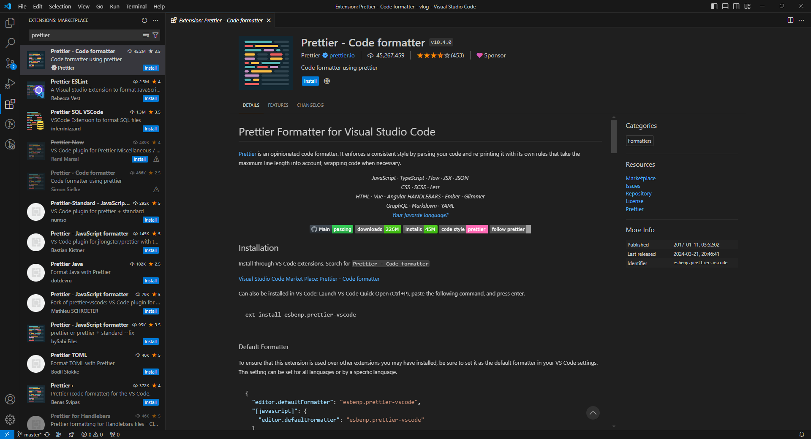
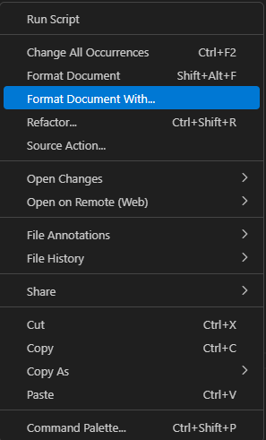
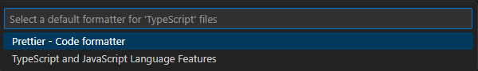

# Prettier 一个 “有态度” 的代码格式化工具

## 概要
`提示：什么是 Prettier？`

Prettier 是一个用来格式化代码的工具，或者称为包或插件。它的作用就是”格式化代码“，使代码更加整齐、易读

## 为什么要用 Prettier
原因只有一个，那就是统一代码格式风格。关于代码的格式化风格，每个团队、每个开发者都有自己的喜好，因此关于代码风格的争论也从未停止。公说公有理，婆说婆有理，到底该听谁的呢？Prettier于是便诞生了，它强制制定了一套格式化风格，并且只提供了少量的配置项供开发者自定义

例如：
- 该使用单引号还是双引号
- 语句的末尾要不要加分号
- 缩进量是 2 还是 4
- 换行的长度阈值是 80 还是 100

事实上，新兴的编程语言很多都会自带格式化工具，例如 Golang 的 gofmt，Rust 的 rustfmt。既然大家都没有统一的代码风格，那官方就直接给强制统一了。而Prettier 虽然是由前端社区推出的工具，但他确实做的很优秀，Prettier 的风格也受到大多数人的认可。其中以 vue-cli 和 create-vue 脚手架为例，二者都提供了关于 Prettier 的配置项

## 怎么使用 Prettier

### 1. 通过给 IDE 开发工具安装插件
  - 以vscode为例，直接在插件搜索 Prettier 并安装

    

  - 安装之后，鼠标右键配置默认的格式化工具

    

  - 因为vscode本身有一种格式化选项，需要将默认选项更改为 Prettier

    

  这样就可以通过快捷键 `Shift + Alt + F` 或者 `鼠标右键` 使用 Prettier 快速进行格式化

   

### 2. 通过脚本命令
给开发工具安装插件虽然简单快捷，但是在多人协作的项目中，如何能保证每个人都给 vscode 安装了 Prettier插件呢？所以我们需要给项目安装 Prettier 库到开发依赖中，通过配置脚本命令来使用 Prettier 进行代码格式化
  
  - 安装依赖

  ::: code-group
  ```shell [npm]
  $ npm i -D prettier
  ```
  ```shell [pnpm]
  $ pnpm i -D prettier
  ```
  :::

  - 配置脚本命令

  ```json
  // 格式化所有内容
  {
    "scripts": {
      "format": "prettier --write ." 
    }
  }

  // 格式化某个目录或某个文件
  {
    "scripts": {
      "format": "prettier --write app/components/Button.js" 
    }
  }
  ```

  - 执行脚本
  ::: code-group
  ```shell [npm]
  $ npm run format
  ```
  ```shell [pnpm]
  $ pnpm run format
  ```
  :::

这里就会产生另一个问题，假设第一个人在项目里配置了 prettier ，但是第二个人写完代码之后并没有执行 format 命令，这又该怎么办呢？此时就要用到 `Git hooks`（后面篇章会详细介绍），在提交代码时触发hook钩子自动执行 format 命令，先把代码格式化一波，然后再提交。这样就能实现团队中每一个成员，无论他知不知道 Prettier、无论他有没有装插件，有没有手动执行 format 命令，都能保证提交的代码都是经过 Prettier 格式化过的代码

## 配置文件

上面两种方式全部采用的是 Prettier 默认配置，比如 Prettier 默认使用双引号。那如果我就想用单引号该怎么办？此时就需要使用 Prettier 的配置文件
